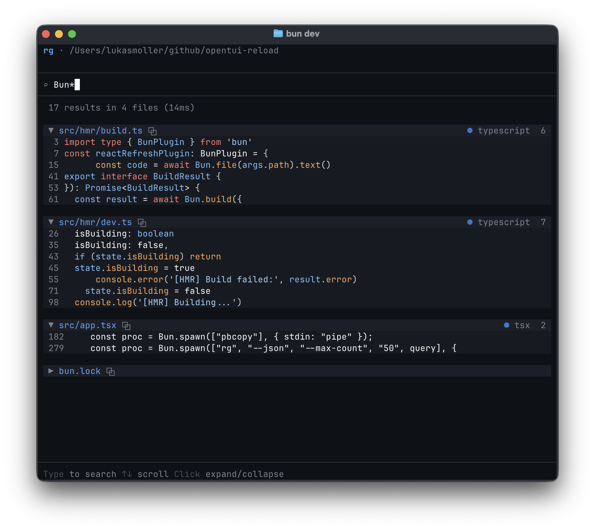

# rgotui

A terminal UI for [ripgrep](https://github.com/BurntSushi/ripgrep) built with [OpenTUI](https://github.com/sst/opentui) + React. Mostly an experiment for React Refresh / HMR in terminal apps.



## Try it

```bash
bunx github:lukasmoellerch/rgotui
```

## Development

```bash
bun install
bun run start      # Run the app
bun run dev        # Run with hot reload
```
